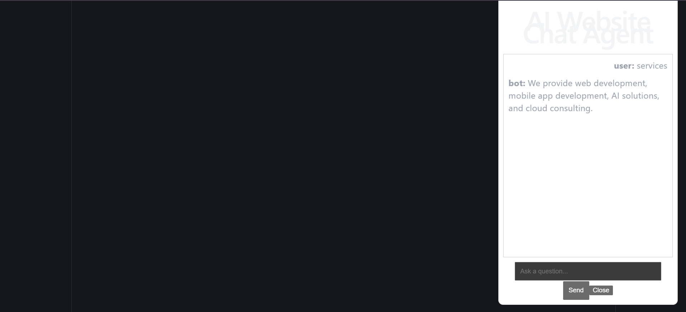
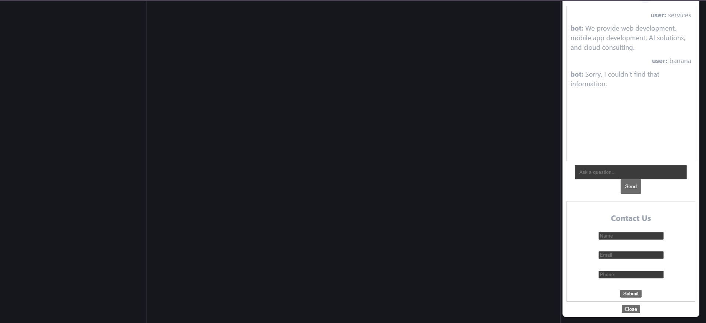
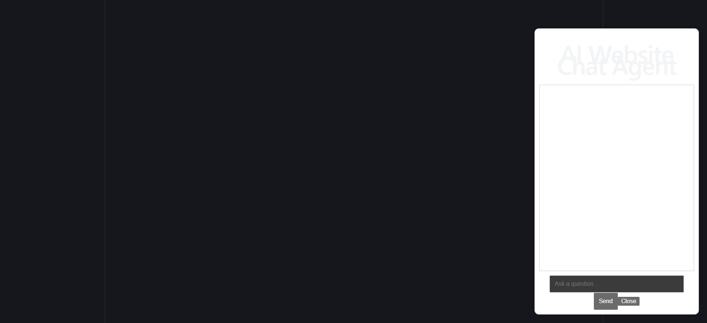
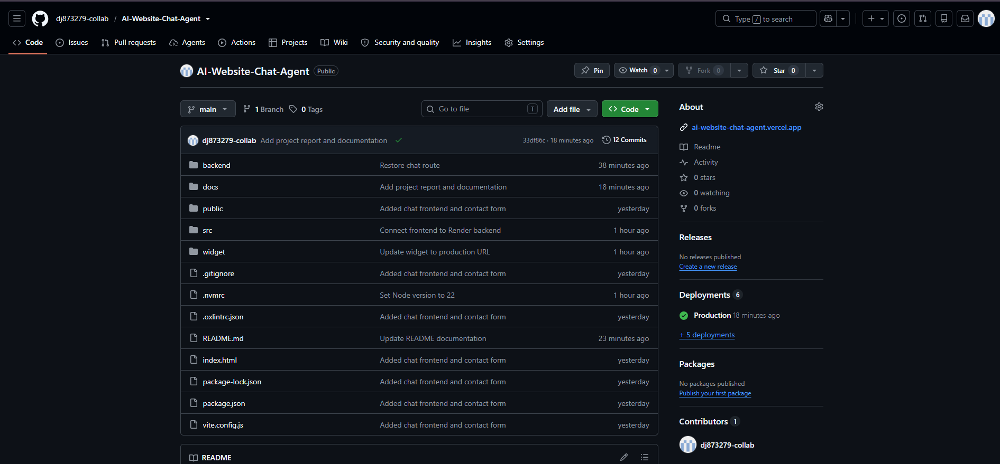

# AI Website Chat Agent

## Internship Assignment Submission Report

### Submitted By

Darshil Joshi

---

# 1. Project Overview

The AI Website Chat Agent is a full-stack chatbot application designed to answer website-related user queries using indexed website content.

If the chatbot cannot find a relevant answer, it automatically escalates the conversation to a contact form where user details can be collected and stored as business leads.

The solution is designed to be embedded into any website through a lightweight JavaScript widget.

---

# 2. Problem Statement

Businesses often lose potential customers when website visitors cannot quickly find the information they need.

This project addresses that problem by:

* Providing instant answers to common questions
* Reducing support workload
* Capturing potential leads automatically
* Allowing easy integration into existing websites

---

# 3. System Architecture

User Website
↓
Embeddable Chat Widget
↓
React Frontend (Vercel)
↓
Express Backend API (Render)
↓
Knowledge Base (content.json)

For unanswered questions:

User
↓
Contact Form
↓
Contact API
↓
Lead Storage

---

# 4. Features Implemented

### Website Content Indexing

* Static JSON-based content indexing
* Searchable knowledge base
* Fast retrieval

### AI Chat Interface

* Floating widget
* Expand/Collapse functionality
* Conversation history
* Responsive UI

### Search and Response System

* Keyword-based search
* Relevant content matching
* Source support

### Contact Form Escalation

* Triggered automatically for unknown queries
* Collects:

  * Name
  * Email
  * Phone Number
  * Requirement

### Lead Management

* Lead storage system
* Unique lead tracking

### Embeddable Widget

* Lightweight JavaScript integration
* Website independent
* Mobile compatible

---

# 5. Technology Stack

## Frontend

* React
* Vite

## Backend

* Node.js
* Express

## Data Storage

* JSON Knowledge Base
* JSON Lead Storage

## Deployment

* Vercel
* Render

## Version Control

* Git
* GitHub

---

# 6. API Design

## Chat API

POST /api/chat

Purpose:
Returns the most relevant answer from indexed content.

Input:
{
"message": "What services do you provide?"
}

Output:
{
"answer": "...",
"source": "...",
"found": true
}

---

## Contact API

POST /api/contact

Purpose:
Stores lead information when no answer is available.

Input:
{
"name": "...",
"email": "...",
"phone": "...",
"message": "..."
}

Output:
{
"success": true
}

---

# 7. Deployment Details

Frontend:
https://ai-website-chat-agent.vercel.app

Backend:
https://ai-website-chat-agent-backend.onrender.com

Repository:
https://github.com/dj873279-collab/AI-Website-Chat-Agent

---

# 8. Workflow Demonstration

1. User opens website.
2. Chat widget appears.
3. User asks a question.
4. System searches indexed content.
5. Relevant answer is returned.
6. If no answer exists:

   * Contact form appears.
   * User submits details.
   * Lead is stored.

---

# 9. Future Improvements

* OpenAI Integration
* Semantic Search
* Vector Embeddings
* Admin Dashboard
* Analytics
* Multi-language Support
* Live Agent Handoff
* Voice Input

---

# 10. Conclusion

The project successfully meets the assignment requirements by providing an embeddable AI-powered chatbot capable of answering website-related questions and converting unanswered queries into business leads through automated contact form escalation.

# 11. Screenshots

## Chat Response

## Contact Form Escalation

## Widget Integration

## Repository
